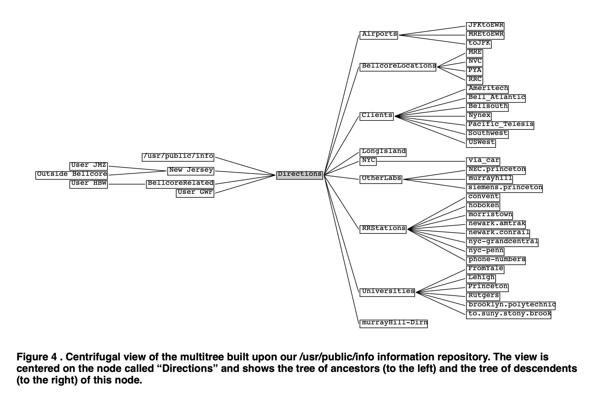
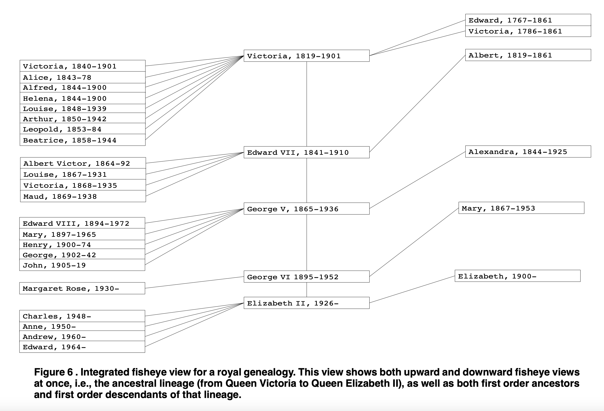

# The Name

Trees are *everywhere* in I.T. and in Knowledge Representation.
There's no avoiding them. But when your main hammer is an RDBMS,
a tree is a difficult thing to nail, and resistant to ornamentation.

But there are some interesting ideas "out there". One is `RelFS`,
and another is `muiltitrees`.

So let's say: `Tree + RelFS + Multitree => Trellis => _trellous_`

_(... and interestingly enough, a trellis is what a multitree
can resemble)_

# About Multitrees 

Trees form the basis of filesystems - and XML too - and no similar 
data structure has achieved the same univeral everyday acceptance.
(Note that hard links and soft links are just window dressing.)

A tree is a directed acyclic graph (DAG), with a single root,
and directed "downward" parent-to-children.

An advantage of their simplicity is that a "regular" tree can
be rendered quite easily, like so:

```
~/trellous >> tree
.
├── local
│   ├── Designing better file orgzn around tags not hierarchies.xhtml
│   ├── File Systems The Original Hypermedia.html
│   ├── MultiTrees.pdf
│   └── RelFS A Hypothetical Tag-Based File System.html
├── menifasto.md
```

A **Multitree** is a variation on this that has certain
additional features and advantages.

Furthermore, when you want to represent multiple references
to some item, or (to be more specific) content reuse (the
inclusion of identical content in multiple documents), it
is not just multiple child nodes that are important: there
are multiple parent nodes too.

Therefore from the viewpoint of a node, one may speak of
multiple nodes of ***Contents*** but also of multiple
nodes of ***Contexts***.

_The remainder of this section draws from the paper on multitrees._

Regular trees are simple to render, they allow only one way to
get from one node to another so there can be no shortcuts, no
alternative organizations.

But there are other places of interest along this spectrum of
structure from trees to graphs. In particular, there is a class
of structures that can at least offer new options in the design
space for information representation: the **multitree**.

It has the unusual property that although it is not a tree,
the descendents of any node form a tree. Thus familiar tree
presentation and navigation techniques may be used to view
large fragments of the structure.

(_Aside:_ Perhaps one of the simplest examples of such a
structure is when one has two trees sharing the same set
of leaves, for example two classification systems for books,
the Dewey Decimal system and the Library of Congress system.)

General multitrees may share complete subtrees, not just leaves.
("complete subtree" means a node and all its descendents). That
is, hierarchical structure can be shared at multiple granularities.

Multitrees are DAGs, not trees, and as a result a node in the
structure can have multiple parents. In fact it can therefore
have multiple ancestral lineages: one for each tree that (re)uses
it. Thus looking upward from a node one can see the multiple
hierarchical **contexts** in which the node has appeared. So,
whereas looking downward one sees the various contents under
a node (subsection 1, subsection 2, etc.), looking upward one
sees its alternative contexts (as a chapter in Doc1, as Part1
of a college course, etc.).

(_Aside:_ A context can also be used for conditional inheritance.
One could, for example, make the presentation style of a node be
conditional on the selection of a particular context. Thus one
would select for viewing not just some particular chapter of
text, but also indicate the context in which it is being viewed
(e.g. the college course). The formatted look and feel of the
segment of text would be in part inherited from the selected
context and altered accordingly. Thus material is reused but
can be modified by the structural context.)

These comments on multiple parents and their interpretation
as contexts can apply to general DAGs as well. One difference
for multitrees is that the contexts (i.e., ancestor nodes) all
have simple hierarchies beneath them. Thus looking upwards one
sees in effect a choice, not of arbitrary ancestral nodes, but
of possible trees to be browsed. There is in fact special
structure to this set of choices, arising from a structural
duality in multitrees.

A resulting declarative characterization was that multitrees
are DAGs whose nodes have descendents forming only trees. A
new formulation equivalent to this last is to say that these
DAGs have no downward diamonds. A downward diamond is formed
when two downward paths diverge from some node, x, and meet
again some node, y, below. Clearly if such a diamond exists,
then the descendents of x do not form a tree, and if no such
diamond exists they do.

This in turn has the rather surprising consequence that not
only does the set of descendents of any node form a tree,
the set of its ancestors also form a tree (an inverted tree).

In summary, our **Proposition** states that The following
properties are equivalent:
- The DAG can be constructed by adding new tree structure
above existing (or newly added) disjoint complete subtrees.
- The descendents of any node form a tree.
- The DAG is diamond-free.
- The ancestors of any node form an inverted tree.

Any DAG satisfying these conditions is called a multitree.

(Aside: In this light it is interesting to note that genealogies,
though often called “family trees”, are in fact not trees at all.
Except for intermarriage, which would introduce diamonds, they
are multitrees. The property just derived makes sense of the
fact that a given individual has both a tree of ancestors and
a tree of descendants within the structure.)

For information representation, our Proposition means that
looking down from any node in the structure one sees a tree
of contents, and looking up one sees a tree of contexts. As
mentioned already, each of the ancestral contexts itself roots
a downward tree. Thus, although the structure itself is not a
tree, and not planar in general, it has remarkably large easily
identifiable and semantically coherent subsets that are trees,
and hence are planar, and amenable to easy layout.





# Tags

Tag might seem like part of a solution. Perhaps a vast, flat
(i.e. non-hierarchical) pool of content, with faceted tags for
narrowing searches down. But that doesn't really work either.
Not well, anyways.

Furthermore, to be useful, tags themselves should be hierarchical,
and that is a complicating factor.	

So, any particular content node can have
- multiple children
- multiple parents
- multiple incoming facet links
- and let's not forget
  - arbitrarily large amounts of metadata
  - multiple versions
  - multiple formats of (re)presentation
  - maybe multiple languages 
  - concurrent modification
  - workflow status

This makes it all much more interesting than a simple top-down tree.

# Foods for Thought

- [RelFS summary at GH](https://github.com/nayuki/Relational-File-System)
- [RelFS rationale](https://www.nayuki.io/page/designing-better-file-organization-around-tags-not-hierarchies)
- [RelFS commentary](https://karl-voit.at/2020/05/19/RelFS/)
- [File Systems: The Original Hypermedia](https://jon.work/og/#1) 
- [Multitrees: Enriching and Reusing Hierarchical Structure](https://adrenaline.ucsd.edu/kirsh/Articles/In_Process/MultiTrees.pdf) 
- _(local copies are in subdirectory `local/`)_

# UI

If tags are done right, then foldirectory structure
becomes just a default mode for navigation, and a
substructure for the rest of the system to build on. 

When contexts are wanted in addition to contents,
and when tags are wanted, a 2-by-2 grid might work,
whetehr the item is a foldirectory or a document:

```
+----------+----------+-----------------+
|(bookmarx)|          | (  min / max  ) |
|  Con-    | Longish  | ( render type ) |
| texts    | Listing  | ( media cntls ) |
| (few)    | of Peer  |                 |
+----------+ Items    |                 |
|          | (w 1+    |                 |
|  Tag     | item(s)  |    CONTENTS     |
|  Stuff,  | in focus)|                 |
|  A.I.    |          |    wysiwyg      |
|  I/F     +----------+    markup       |
|          | Shortish |    image        |
|  popup   | Descr.   |    reviews      |
| browser, +----------+    database     |
| comments | Metadata |    dataframe(s) |
+----------+ Fields   |                 |
| Messages |(workflow)|                 |
|  and/or  |(versions)|                 |
|  History |(language)|                 |
+----------+----------+-----------------+

```
Note that when a DB or DF is in focus,
the right-side pane becomes a browser
for structured data.

Note that this UI model might also work for
productivity (GTD / task mgmt / reminders).

-end-
